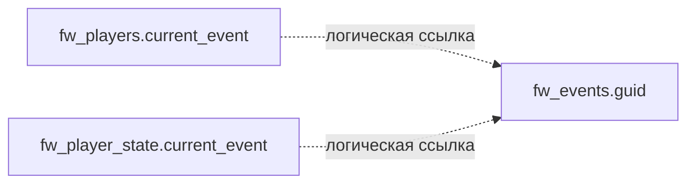

Ниже ER-диаграмма базы в формате **Mermaid** по фактической структуре дампа. Я отразил только реальные таблицы и реальные FK из DDL. Отдельно пометил **логическую связь** `fw_players.current_event -> fw_events.guid` и `fw_player_state.current_event -> fw_events.guid`, потому что в дампе для них внешний ключ **не задан**. 

```mermaid
erDiagram
    USER {
        char32 guid PK
    }

    FW_EVENTS {
        char32 guid PK
        int event_type
        varchar64 caption
        text description
        tinyint disabled
        datetime created_at
        datetime updated_at
        datetime deleted_at
        char32 created_by FK
        char32 updated_by FK
        char32 deleted_by FK
    }

    FW_EVENT_MODIFIER {
        char32 guid PK
        tinyint disabled
        datetime created_at
        datetime updated_at
        datetime deleted_at
        char32 created_by FK
        char32 updated_by FK
        char32 deleted_by FK
        char32 event_guid FK
        char32 modifier_guid FK
        json config
    }

    FW_EVENT_TAG {
        char32 guid PK
        char32 event_guid FK
        char32 tag_guid FK
        tinyint disabled
        datetime created_at
        datetime updated_at
        datetime deleted_at
        char32 created_by FK
        char32 updated_by FK
        char32 deleted_by FK
    }

    FW_MODIFIERS {
        char32 guid PK
        tinyint disabled
        datetime created_at
        datetime updated_at
        datetime deleted_at
        char32 created_by FK
        char32 updated_by FK
        char32 deleted_by FK
        int modifier_type
        varchar64 class
        varchar64 caption
        text description
    }

    FW_MODIFIER_TAG {
        char32 guid PK
        tinyint disabled
        datetime created_at
        datetime updated_at
        datetime deleted_at
        char32 created_by FK
        char32 updated_by FK
        char32 deleted_by FK
        char32 modifier_guid FK
        char32 tag_guid FK
    }

    FW_PLAYERS {
        char32 guid PK
        tinyint disabled
        datetime created_at
        datetime updated_at
        datetime deleted_at
        char32 created_by FK
        char32 updated_by FK
        char32 deleted_by FK
        int status
        char32 current_event
        json parameters
        datetime processed_at
    }

    FW_PLAYER_STATE {
        char32 guid PK
        tinyint disabled
        datetime created_at
        datetime updated_at
        datetime deleted_at
        char32 created_by FK
        char32 updated_by FK
        char32 deleted_by FK
        int status
        varchar32 current_event
        json parameters
    }

    FW_SETTINGS {
        varchar127 name PK
        text value
        datetime created_at
        datetime updated_at
        char32 created_by FK
        char32 updated_by FK
    }

    FW_TAGS {
        char32 guid PK
        int tag_type
        varchar64 caption
        text description
        tinyint disabled
        datetime created_at
        datetime updated_at
        datetime deleted_at
        char32 created_by FK
        char32 updated_by FK
        char32 deleted_by FK
    }

    USER ||--o{ FW_EVENTS : "created_by"
    USER ||--o{ FW_EVENTS : "updated_by"
    USER ||--o{ FW_EVENTS : "deleted_by"

    USER ||--o{ FW_EVENT_MODIFIER : "created_by"
    USER ||--o{ FW_EVENT_MODIFIER : "updated_by"
    USER ||--o{ FW_EVENT_MODIFIER : "deleted_by"
    FW_EVENTS ||--o{ FW_EVENT_MODIFIER : "event_guid"
    FW_MODIFIERS ||--o{ FW_EVENT_MODIFIER : "modifier_guid"

    USER ||--o{ FW_EVENT_TAG : "created_by"
    USER ||--o{ FW_EVENT_TAG : "updated_by"
    USER ||--o{ FW_EVENT_TAG : "deleted_by"
    FW_EVENTS ||--o{ FW_EVENT_TAG : "event_guid"
    FW_TAGS ||--o{ FW_EVENT_TAG : "tag_guid"

    USER ||--o{ FW_MODIFIERS : "created_by"
    USER ||--o{ FW_MODIFIERS : "updated_by"
    USER ||--o{ FW_MODIFIERS : "deleted_by"

    USER ||--o{ FW_MODIFIER_TAG : "created_by"
    USER ||--o{ FW_MODIFIER_TAG : "updated_by"
    USER ||--o{ FW_MODIFIER_TAG : "deleted_by"
    FW_MODIFIERS ||--o{ FW_MODIFIER_TAG : "modifier_guid"
    FW_TAGS ||--o{ FW_MODIFIER_TAG : "tag_guid"

    USER ||--o{ FW_PLAYERS : "created_by"
    USER ||--o{ FW_PLAYERS : "updated_by"
    USER ||--o{ FW_PLAYERS : "deleted_by"

    USER ||--o{ FW_PLAYER_STATE : "created_by"
    USER ||--o{ FW_PLAYER_STATE : "updated_by"
    USER ||--o{ FW_PLAYER_STATE : "deleted_by"

    USER ||--o{ FW_SETTINGS : "created_by"
    USER ||--o{ FW_SETTINGS : "updated_by"

    USER ||--o{ FW_TAGS : "created_by"
    USER ||--o{ FW_TAGS : "updated_by"
    USER ||--o{ FW_TAGS : "deleted_by"
```

### Логические связи, которых нет как FK в DDL

Их лучше показать отдельно, чтобы не смешивать с фактическими ограничениями:

### Краткая группировка по подсистемам

* **Игрок / состояние:** `fw_players`, `fw_player_state`
* **События:** `fw_events`, `fw_event_tag`, `fw_event_modifier`
* **Модификаторы:** `fw_modifiers`, `fw_modifier_tag`
* **Теги:** `fw_tags`
* **Настройки движка:** `fw_settings`
* **Внешняя сущность:** `user` 

### Что требует проработки в логической модели

* `fw_players.current_event` — логически похоже на ссылку на `fw_events.guid`, но FK нет
* `fw_player_state.current_event` — аналогично, FK нет
* `fw_player_state` по текущим тезисам зарезервирована и пока не используется в MVP
* `fw_settings.value` хранит ссылки на GUID и иные настройки в текстовом виде, без FK-контроля на уровне БД

